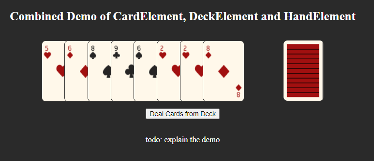

# Sprint 3 Review (June 3, 2025)

TODO: Add images to all these

## Overview
This sprint had a lot of work put in, but unfortunately not much to document for notes. I would say more has been achieved than Sprint 2, but it was more so in tying existing code together and ensuring things worked than writing new features.

## 1. The UI Scorekeeper (Anthony)
The scorekeeper is live and merged! It's styled well and fits in exactly with the style we had intended. It is well laid out and looks stylish while not distracting from the gameplay.

(See an image later, it's on the left for Main Game Window!)

## 2. The Deck Element (Yifei, Min, Nathan)
It has been one heck of a group effort to try and get this element implemented, and I thought it would be one of the simplest at the start. After multiple sprints of work, Min finally managed to get the Deck working with Codacy. I spent hours trying to get that working, and I assume he did too, but finally Yifei's Deck from the first sprint is fully up to date and should be merged later today! This marks the first time every UI element has been fully functional and worked together to implement the gameplay feel!

## 3. The Main Game Window (Anthony)
A hard-earned sight is to see the game window finally laid out as it's supposed to be. All the UI elements are ready and present, so Anthony has created the game window and supporting structure to get them ready to go!

## 4. And so much more.
There was a lot more achieved I couldn't just summarize into one of these items. Work was a lot more spread out over multiple things this time around, not something you could really wrap up nicely in a bow for a textbox. I wanted to just add one to say that everyone that's been getting things going and fixing things up has been doing great so far, and we're finally starting to be able to put things together and see the fruits of our work!