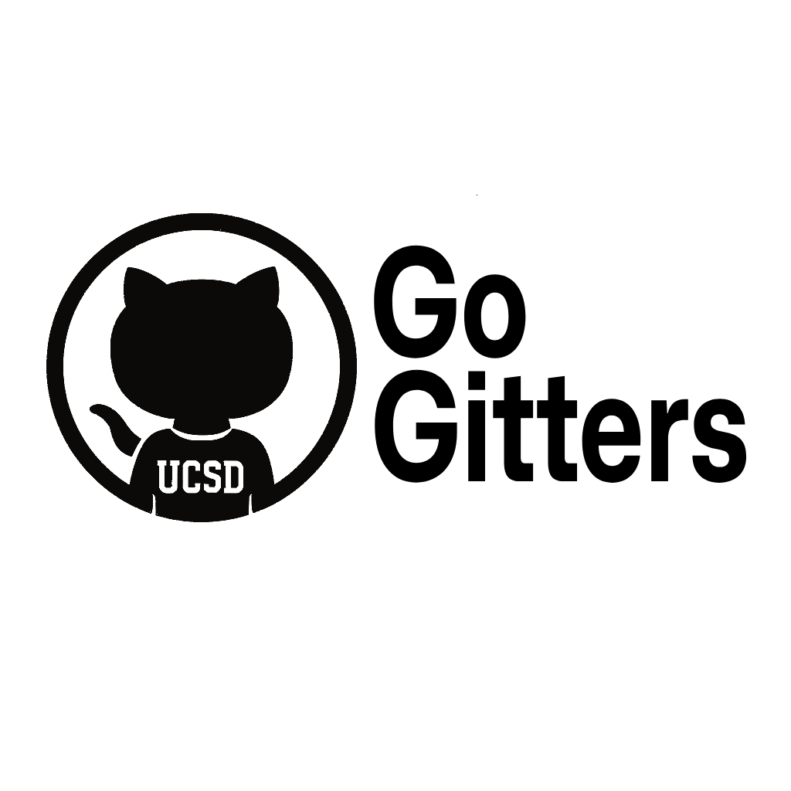

# Go Gitters Team 26 Page

[Go to Welcome](#welcome)

[Go to Team Values](#team-values)

[Go to Team Roster](#team-roster)

## Welcome
Hello! Welcome to Team 26's Page! Our team name is Go Gitters. We are super excited to develop a great project this quarter.

### Our First Team Photo!

### Our Team Logo

## Team Values
Some of our team values include: 

- Complete your assigned tasks on time
- Support your fellow team members 
- Communicate with the team
- Be respectful

## Team Roster
Here is our team for this quarter:

- Nathan Reed: Hi, I'm Nathan Reed, a 2nd year CS student! I develop a wide variety of software, with a specialization more in backend bare-metal development. I'll be mainly working to organize our group and tie everyone's skills together to build a great project, but I'll also be helping program when I can! My person GitHub Page is available here: [Nathan's GitHub](https://github.com/Minater247)
- Hanbin Tan: Hello, I'm Hanbin Tan. I'm a third year CAS major with an interest in cloud engineering. I aim to bring creativity and diligence to our projects.  Here is a link to my personal  page: [Hanbin's GitHub](https://hanbintan.com)
- Sruti Mani: Hi my name is Sruti Mani, and I am a third year Mathematics: Computer Science major. I am interested in software development and project management. Here is a link to my personal github page: [Sruti's GitHub](https://github.com/srutimani)
- Anthony Velikov: Im Tony and im a 3rd year Computer Science major. Im going to be focused on bringing the team together but im also excited to get technical and code. [Tony's GitHub](https://github.com/AnthonyVelikov)
- Chaitya Jodhavat: Hi, I'm Chaitya and I'm a second year Computer Science major. I am interested in full-stack software engineering and machine learning. I hope to develop this project to the fullest of my abilities! Here's my GitHub page: [Chaitya's Github](https://github.com/ChaityaJ21)
- Jason Huang: Hi, I'm Jason and I am a second year Computer Science major. I hope to work along with my teammates to code and build a good project that could go on our resumes. Here's my github: [Jason's Github](https://github.com/jasonhuan9)
- Kevin Lee: Hi my name is Kevin Lee, and I am a third year CS major. I am interested in full-stack development. Here is a link to my personal github page: [Kevin's Github](https://github.com/kevinlee1989)
- Long Hodac: Hello, I'm Long and I'm a 3rd year CS major. I am interested in full-stack developing and Data Analytics. I'm excited to work and contribute to the team. Here is a link to my github page: [Long's Github](https://github.com/longhodac-ucsd)
- Mahdi Najjar: Hello, my name is Mahdi and I am a 3rd year Computer Science major. I am interested in Software Development and I am currently working on my portfolio. Here is my github link: [Mahdi's Github](https://Github.com/Mahdilla).
- Min Paing: Hi My name is Min Aung Paing. I am a junior majoring in Computer Science. I am interested in backend development and have some background in Full-stack web development. I am excited to work on this project with these amazing teammates. Here is link to my github: [MgMap](https://github.com/MgMap)
- Yifei Xue: Hi I'am Yifei and I am a second year math-cs student. I have full-stack experience and is looking forward to further practice my back-end skills. Here is the link to my github: [Yifei's Github](https://github.com/YifeiXue111)
