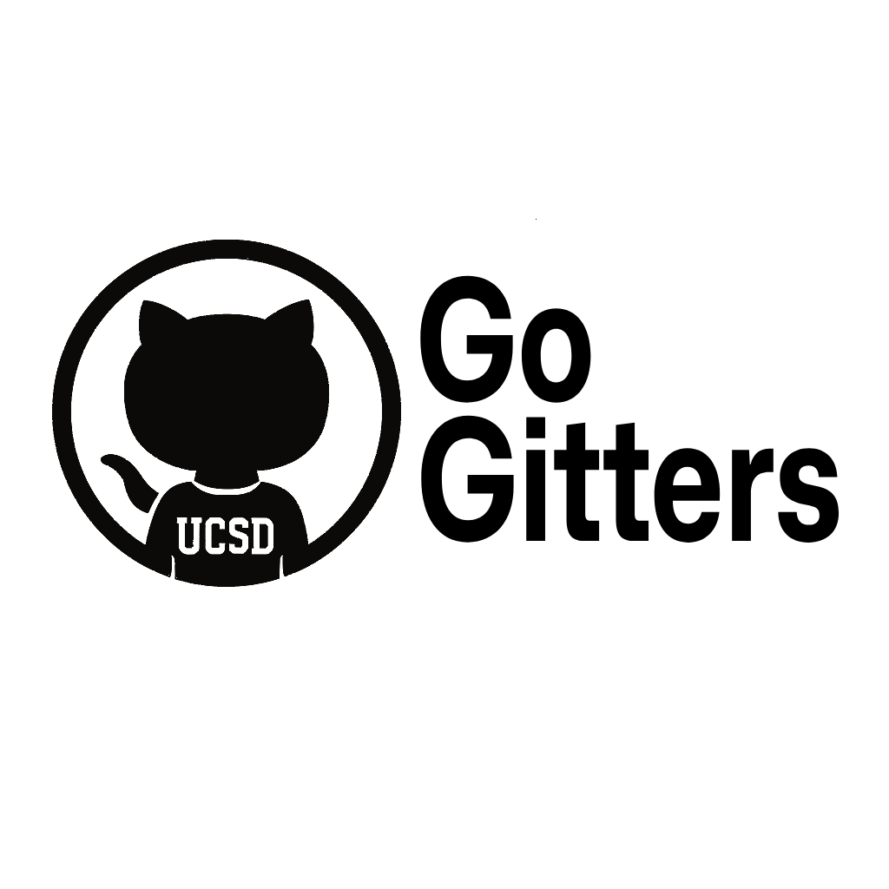

# Go Gitters Team 26 Page

[Go to Welcome](#welcome)

[Go to Team Values](#team-values)

[Go to Team Roster](#team-roster)

## Welcome
Hello! Welcome to Team 26's Page! Our team name is Go Gitters. We are super excited to develop a great project this quarter.

### Our First Team Photo!

### Our Team Logo

## Team Values
Some of our team values include: 

- Complete your assigned tasks on time
- Support your fellow team members 
- Communicate with the team
- Be respectful

## Team Roster
Here is our team for this quarter:

- Nathan Reed: 
- Hanbin Tan: Hello, I'm Hanbin Tan. I'm a third year CAS major with an interest in cloud engineering. I aim to bring creativity and diligence to our projects.  Here is a link to my personal  page: [Hanbin's GitHub](https://hanbintan.com)
- Sruti Mani: Hi my name is Sruti Mani, and I am a third year Mathematics: Computer Science major. I am interested in software development and project management. Here is a link to my personal github page: [Sruti's GitHub](https://github.com/srutimani)
- Anthony Velikov: Im Tony and im a 3rd year Computer Science major. Im going to be focused on bringing the team together but im also excited to get technical and code. [Tony's GitHub](https://github.com/AnthonyVelikov)
- Chaitya Jodhavat:
- Jason Huang:
- Kevin Lee:
- Long Hodac:
- Mahdi Najjar: 
- Min Paing: Hi My name is Min Aung Paing. I am a junior majoring in Computer Science. I am interested in backend development and have some background in Full-stack web development. I am excited to work on this project with these amazing teammates. Here is link to my github: [MgMap](https://github.com/MgMap)
- Yifei Xue: 
