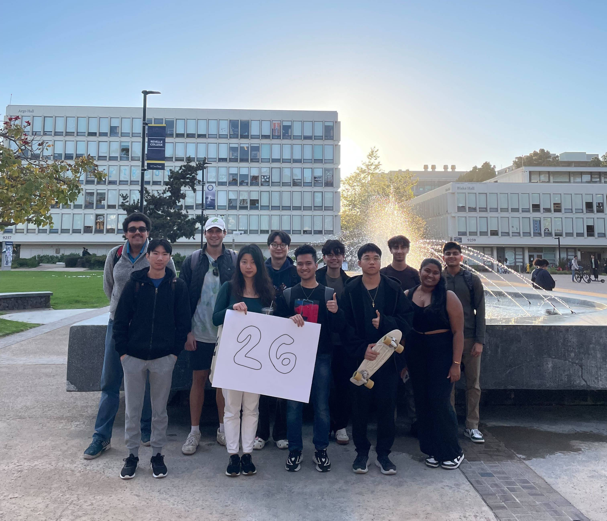

# Go Gitters Team 26 Page

[Go to Welcome](#welcome)

[Go to Team Values](#team-values)

[Go to Team Roster](#team-roster)

## Welcome
Hello! Welcome to Team 26's Page! Our team name is Go Gitters. We are super excited to develop a great project this quarter.

## Team Values
Some of our team values include: 

- Complete your assigned tasks on time
- Support your fellow team members 
- Communicate with the team
- Be respectful

## Team Roster
Here is our team for this quarter:

- Nathan Reed: 
- Hanbin Tan:
- Sruti Mani: Hi my name is Sruti Mani, and I am a third year Mathematics: Computer Science major. I am interested in software development and project management. Here is a link to my personal github page: [Sruti's GitHub](https://github.com/srutimani)
- Anthony Velikov:
- Chaitya Jodhavat:
- Jason Huang:
- Kevin Lee:
- Long Hodac:
- Mahdi Najjar: 
- Min Paing:
- Yifei Xue: 